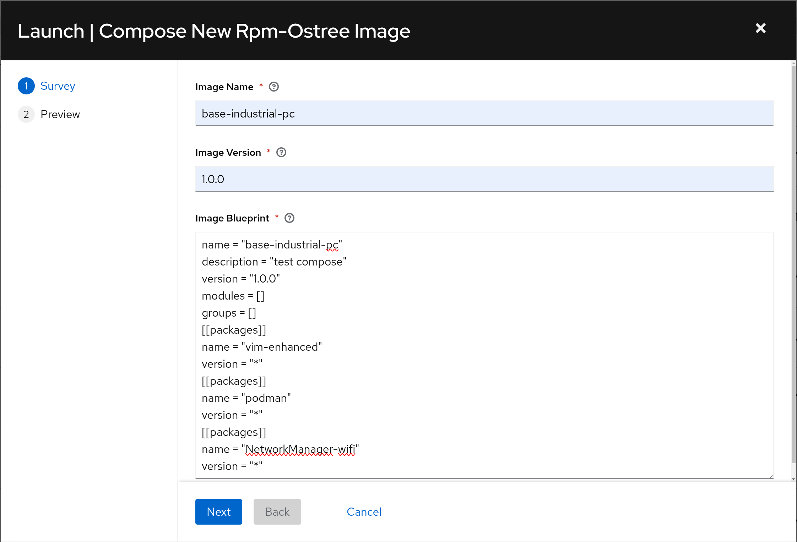

# RPM Ostree Lifecycle Management
This chart supports the [IT Automation-led DCN Operating System Lifecycle Management](https://github.com/RedHatEdge/patterns/tree/main/patterns/it-automation-led-rpm-ostree-lifecycle) pattern.

It automatically applies configuration to the IT automation service, ensuring the pattern's solution is available for consumption.

## Required Values
The following values are required when deploying this chart:
```yaml
---
# Information for connecting to Ansible Controller
controllerInformation:
  # Endpoint of controller
  hostname: controller.your-company.com
  # Username to authenticate with
  username: admin
  # Password to authenticate with
  password: your-password-here

# Credentials for various components
credentials:
  # If playbooks are kept in a private repo, uncomment the following and enter the correct information
  # github:
      # Username for GitHub/git server
  #   username: your-github-username
      # Password or private access token
  #   PAT: your-private-access-token
  # What credentials to set on the image builder virtual machine
  virtualMachine:
    # What username to set
    username: ansible
    # What password to set
    password: password
  # Credentials for accessing the corresponding OpenShift cluster
  openShift:
    # Endpoint of the cluster's API
    host: https://api.your-cluster.com:6443
    # Token that can be used for authentication
    token: sha256~123abc
  # Credentials for downloading container images from registry.redhat.io
  rhsm:
    # Username to use
    username: your-rhsm-username
    # Password to use
    password: your-rhsm-password

# Where the playbooks live
sourceControl:
  # Point to this repo
  repoURL: https://github.com/RedHatEdge/acp-operations.git
  # Path in the repo where the playbooks life
  playbooksPath: charts/rpm-ostree-lifecycle-management/playbooks

# What version of the oc client to use - match to the version of the OpenShift cluster
openShiftClientVersion: '4.17'

# Where to store the composed image's host container
containerRegistry:
  # Registry and path for the image
  path: default-route-openshift-image-registry.apps.your-cluster.com/rpm-ostree-management
  # Auth file to store image registry credentials
  authFile: /tmp/registry.json
  # If the internal registry of a cluster is being used
  useInternalRegistry: true

```

## Deployment
This chart can be deployed through the declarative state management service, or by direct deployment using helm.

To deploy it directly with helm, run the following:
```
helm install \
-f /path/to/values.yaml \
--namespace rpm-ostree-management \
rpm-ostree-management \
charts/rpm-ostree-management/ \
--create-namespace
```

## Results
Once this chart has been deployed and the IT automation service configured, a workflow will be created to drive the lifecycle management experience:

