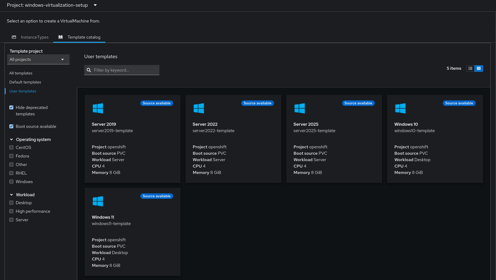

# Windows Virtualization Setup
This chart sets up the required resources for creating Windows virtual machine templates on an ACP. It relies on a few other core services, mainly the virtualization, converged or local storage, and the pipelines services.

Once deployed, installation ISOs for the specified Windows operating systems will be imported, and pipelines to create templates on the platform will be created. Running these pipelines will create a bootable data volume, connect it to a data source, and create the corresponding virtual machine templates for easy deployment of Windows virtual machines.

## Supported Operating Systems and Autounattends
The following Windows operating systems have been tested, and autounattends are provided in this chart:
| Name | Working | Notes |
| --- | --- | --- |
| Windows 10 | :white_check_mark: | Must provide KMS/valid key |
| Windows 11 | :white_check_mark: | Must provide KMS/valid key, Must press key on first boot to boot from CD/DVD |
| Server 2019 | :white_check_mark: | N/A |
| Server 2022 | :white_check_mark: | Must press key on first boot to boot from CD/DVD |
| Server 2025 | :white_check_mark: | Must press key on first boot to boot from CD/DVD |

The autounattends are stored as ConfigMaps, and their templates are located in the [autounattends](./templates/image-prep/autounattends) directory.

Testing was done with the evalation ISOs provided by Microsoft.

## Required Values
The following values are required when deploying this chart:
```yaml
# What the administrator account password, and optional admin account password should be
defaultAdminPassword: adminPassw0rd4templ4tes
# What the default timezone for the template should be
timeZone: Central Standard Time
# What version of the virtio container disk to use - v1.1.1 tested
virtioContainerDiskVersion: v1.1.1
# How long to wait before declaring the pipeline run a failure
buildTimeout: 2h0m0s

# What storage classes to use
# If using the converged storage service, the recommended storage class is `ocs-storagecluster-ceph-rbd-virtualization`
installerIsoCopyStorageClass: ocs-storagecluster-ceph-rbd-virtualization
templateInstallStorageClass: ocs-storagecluster-ceph-rbd-virtualization
templateDataVolumeStorageClass: ocs-storagecluster-ceph-rbd-virtualization

# Provide product keys for templates, or optionally, use the KMS keys
productKeys:
  windows10: kms-key-here
  windows11: kms-key-here

# List of operating systems to create a template/pipeline/etc for
windowsOperatingSystems:
    # Lowercase name used for resources
  - name: windows10
    # Where to download the installation ISO from
    url: "http://your-web-server-here.com/windows10.iso"
    # Display name for the template
    displayName: "Windows 10"
    # Name of the autounattend configmap
    # Should match what's in ./templates/image-prep/autounattends
    autounattendConfigMap: windows10-autounattend
    # Performance profile for the 
    profile: desktop
    # If the created pipeline should be run immediately after creation
    autoRunPipeline: true

    # Same structure as above
  - name: server2019
    url: "http://your-web-server-here.com/server2019.iso"
    displayName: "Server 2019"
    autounattendConfigMap: server2019-autounattend
    profile: server
    autoRunPipeline: true

    # Same structure, but enable uefi and secure boot
  - name: windows11
    url: "http://your-web-server-here.com/windows11.iso"
    displayName: "Windows 11"
    autounattendConfigMap: windows11-autounattend-custom
    profile: desktop
    # Set UEFI on
    uefi:
      # Enable secure boot
      secureBoot: true
    autoRunPipeline: true

    # Same structure, but enable uefi and secure boot
  - name: server2022
    url: "http://your-web-server-here.com/server2022.iso"
    displayName: "Server 2022"
    autounattendConfigMap: server2022-autounattend
    profile: server
    uefi:
      secureBoot: true
    autoRunPipeline: true

    # Same structure, but enable uefi and secure boot
  - name: server2025
    url: "http://your-web-server-here.com/server2025.iso"
    displayName: "Server 2025"
    autounattendConfigMap: server2025-autounattend
    profile: server
    uefi:
      secureBoot: true
    autoRunPipeline: true

# Default resources for the created templates
template:
  cpuCores: 4
  memory: 8Gi
  diskSize: 100Gi
```

## Deployment
This chart should be deployed through the declarative state management service, as components rely on the sync wave function of the service.

Use the [meta-chart](../windows-virtualization-setup-app/README.md) to load this into the declarative state management service.

## Results
Once this chart has been deployed and the created pipelines run, the Windows templates will be available under `User templates`, and will denote that a source is available for the template.

